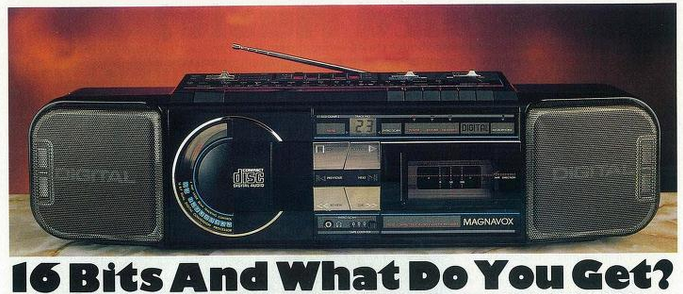

When I was 10 or 11, establishing a library of music was a major identity-building activity among my peers. I had been given a cassette copy of _Thriller_ and somehow had obtained _90125_, but otherwise had only tapes I made by recording off the radio.

I wan't interested in buying more, though. My friend Tym had a Sony Discman and I had heard _The Wall_ in digital clarity. Besides, it used lasers! Unfortunately, it was well beyond the reach of my pre-teen budget and my parents did not care neough about music to invest in a new format.

Circa 1987, though, [Venture](https://en.wikipedia.org/wiki/Venture_Stores) had a marquee sale (maybe loss-leading) on the Maganox D8880 (which I think was a US-badged Philips D8884) and I convinced my parents to let me spend a good portion of my savings on one.

I certainly never regretted it. My CD collection started with a few cringe-worthy pop discs, but when we moved to the city I could walk to [West End Wax](https://www.youtube.com/watch?v=GDEIkIwaFNw) and discovered [Switchblade Symphony](https://en.wikipedia.org/wiki/Serpentine_Gallery_(album)) and [Pet Shop Boys](https://en.wikipedia.org/wiki/Please_(Pet_Shop_Boys_album)) and escaped the cul de sacs of my upbringing.
