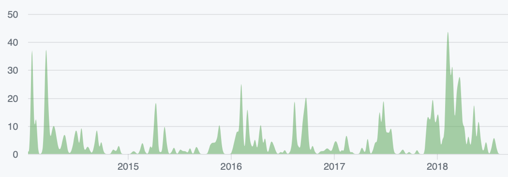

When The Artificial grew up enough to start recruiting, we built a serious website with case studies and all that. Originally we used `theartificial.nl`, and registered `theartificial.us` with ambitions to also have a Seattle presence someday. Eventually we bought `theartificial.com` and transitioned to that.

Shaannon designed it and did some prototyping, and I implemented it with [Middleman](http://middlemanapp.com/). It grew with more than [1600 commits](https://github.com/TheArtificial/theartificial.nl/graphs/contributors?from=2014-01-12&to=2018-08-31) from 10 people of varying skills, largely designers writing blog posts.

The workflows for this were nice, with Markdown content and a build process using Travis CI and Amazon S3 + CloudFront. I was pretty proud of the _cards_ system, that could expose a half-dozen types of content as previews for social sharing and aggregation on [author pages](https://web.archive.org/web/20190317073428/https://theartificial.com/people/carol.html). These were rendered at build but also exposed as templates that could be rendered client-side from [Lunr](https://lunrjs.com/) search data.
