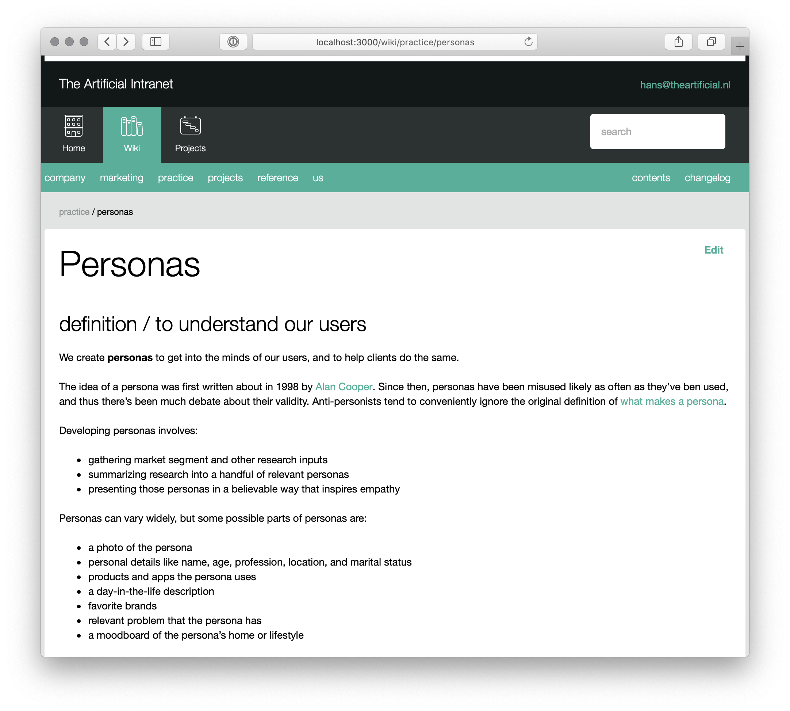

As we hired designers and took on new clients, we outgrew FreeAgent and migrated to Xero for accounting and Shannon created a rigorous framework for planning and tracking work. I built a basic intranet site with Rails for keeping track of project details and to document processes, the employee handbook, etc.

As part of this, I ended up building a [Rails engine wiki](https://github.com/TheArtificial/rails-wiki) tool that used git for storage. So even though the tool has been decommissioned, all that content survives as a git repository of markdown files, with nearly 3500 commits of history.

I was never very proud of this software. I never killed every bug caused by ephemeral server instances sharing content through git. But I was very proud of the content we assembled. Shannon and I regularly wrote to it as we educated our team, which resulted in a rich set of approach documentation and citations. Far from being lost to history, this became source documentation for [Shannon's book](/logs/events/2020-practical-guide/)_.
